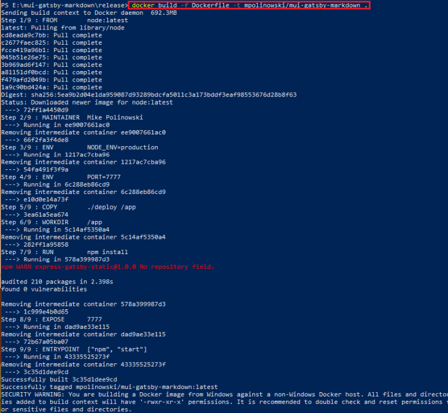
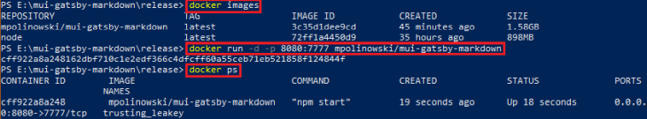
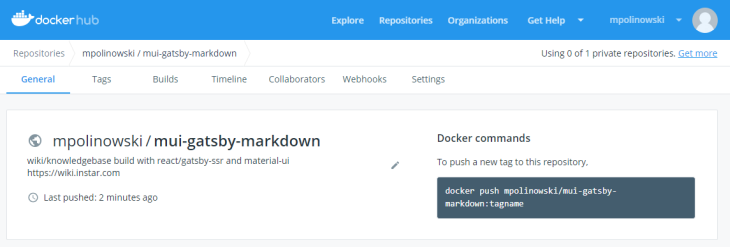
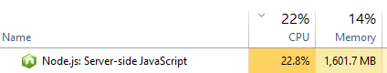
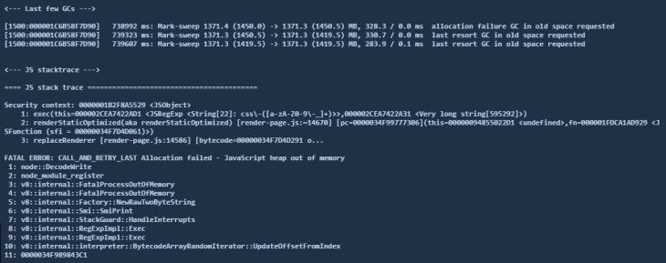

# express-react-ssr

A Wiki Knowledgebase for INSTAR Deutschland GmbH Products - using __Express.js__ with __React__.js and __Gatsby Server Side Rendering__

<!-- TOC -->

- [express-react-ssr](#express-react-ssr)
  - [Use the Gatsby-Cli to scaffold your React App](#use-the-gatsby-cli-to-scaffold-your-react-app)
  - [Run inside a Docker Container](#run-inside-a-docker-container)
  - [Uploading to Docker Hub](#uploading-to-docker-hub)
  - [ES Lint](#es-lint)
  - [Troubleshooting](#troubleshooting)
    - [Raising the default heap limit](#raising-the-default-heap-limit)

<!-- /TOC -->


## Use the Gatsby-Cli to scaffold your React App

First install [Gatsby's command line tool](https://www.npmjs.com/package/gatsby-cli) globally:


```
npm install --global gatsby-cli
```


Start this app in development mode:


```
npm install
npm start
```


Gatsby will start a hot-reloading development environment accessible at _http://localhost:8000_.

To render the app run the following command - note: under Windows use the [Windows Git Bash](https://git-scm.com/download/win):


```
npm run deploy
```


The build will be rendered inside _./public_ and all the files will afterwards be copied to _./release/deploy/app_. Change into this directory and run:


```
npm install
npm start
```


This will start a [Webserver](https://expressjs.com/) that can be reached under [http://localhost:7777](http://localhost:7777).


## Run inside a Docker Container

First install [Docker](https://docs.docker.com/docker-for-windows/) and change into the _./release/deploy/app_ directory. This directory contains a Dockerfile that can be used to build our Docker Image:


```bash
docker build -f Dockerfile -t mpolinowski/mui-gatsby-markdown .
```


This will run the build function of Docker using the our Dockerfile (Note: you don’t have to add the `-f` flag when naming your build file __Dockerfile__. The flag is useful when you have more then one Dockerfiles for different scenarios and have to give them different names accordingly.). The -t flag adds a tag to the Docker image - this can be your docker hub username, or a build version, for internal use. The `.` in the end signifies that docker should search for your code in the current work directory.





You can check if the image was build by typing:


```bash
docker images
```


And run the container by typing:


```bash
docker run -d -p 8080:7777 mpolinowski/mui-gatsby-markdown
```


This command will run your container in -d daemon mode in the background and set the external port of your app to 8080 (the internal port is set by the express app to 7777). You can verify that your app is running by typing:


```bash
docker ps
```





You now have your app running inside the container and can access it by opening http://localhost:8080 inside your web browser.


The container will be assigned a random name automatically - in the case above that is __trusting_leakey__. We can use this to stop and remove the container after testing that everything worked as expected:


```bash
docker stop trusting_leakey
docker rm trusting_leakey
```


## Uploading to Docker Hub

To upload the image to the Docker Hub you first need to create an account there. You can then login to your account from your console and push the image:

```bash
docker login
docker push mpolinowski/mui-gatsby-markdown
```

The image can be found [inside your Docker Hub Repository List](https://cloud.docker.com/repository/docker/mpolinowski/mui-gatsby-markdown):





## ES Lint

Once you have [VS Code](https://code.visualstudio.com/) open, click the Extensions button in the Activity Bar. Install the following extensions:

* [ESLint](https://marketplace.visualstudio.com/items?itemName=dbaeumer.vscode-eslint)
* [Prettier JavaScript Formatter](https://marketplace.visualstudio.com/items?itemName=esbenp.prettier-vscode)
* [Flow Language Support](https://marketplace.visualstudio.com/items?itemName=flowtype.flow-for-vscode)
* [Babel ES6/ES7](https://marketplace.visualstudio.com/items?itemName=dzannotti.vscode-babel-coloring)


We will install [ESLint](http://eslint.org/) using Airbnb’s linter rules. Refer to [Airbnb’s JavaScript Github Repo](https://github.com/airbnb/javascript/tree/master/packages/eslint-config-airbnb#eslint-config-airbnb-1) for the installation instructions.

Install babel-eslint

```
npm install babel-eslint --save-dev
```


Now add an _.eslintrc_ file to your project. Open the eslintrc file and configure it like so:

```json
{
  "parser": "babel-eslint",
  "extends": "airbnb",
  "plugins": [
    "react",
    "jsx-a11y",
    "import"
  ]
}
```


## Troubleshooting

### Raising the default heap limit

Even you still have more then enough Memory, you might receive an error message on build time, when a maximum heap of 1.4 GB is reached by the Node.js Process:



This happened to me during the HTML building step and resulted in a nasty looking __ERROR__ message:



To prevent this, you can start the Gatsby CLI process with a higher memory ceiling - e.g. 8 GB. Locate the CLI Script In case of a _Windows PC_ it will be inside the _AppData\Roaming_ folder, in your user account directory. Now start this script with the flag _--max-old-space-size=8192_ and the argument _build_:

```
node --max-old-space-size=8192 C:\Users\MyWindowsUserName\AppData\Roaming\npm\node_modules\gatsby-cli\lib\index build
```

To make life easy, we can add this as npm run script inside our _package.json_ and start a build with __npm run build__:

```
"scripts": {
    "build": "node --max-old-space-size=8192 C:/Users/MyWindowsUserName/AppData/Roaming/npm/node_modules/gatsby-cli/lib/index build"
  }
```